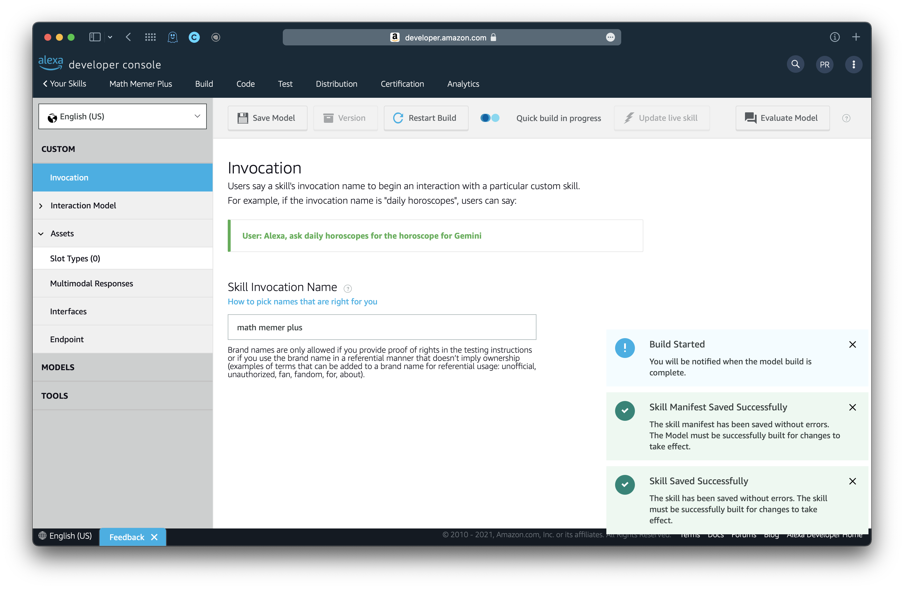
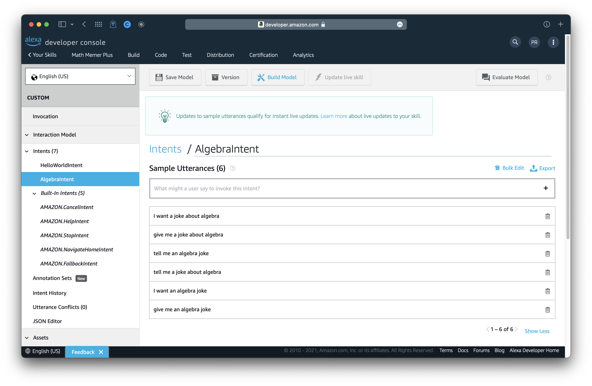
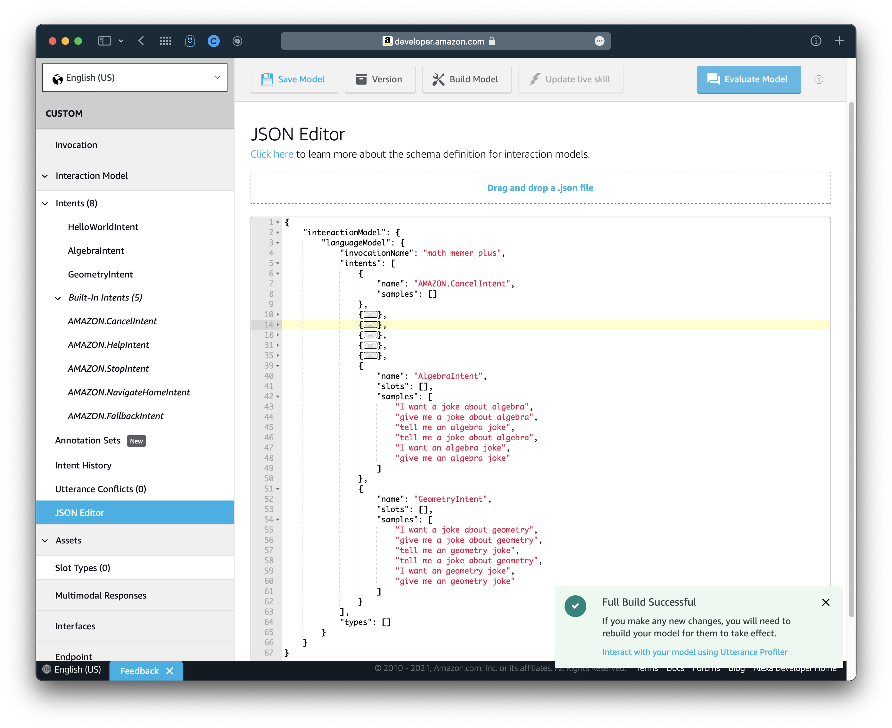
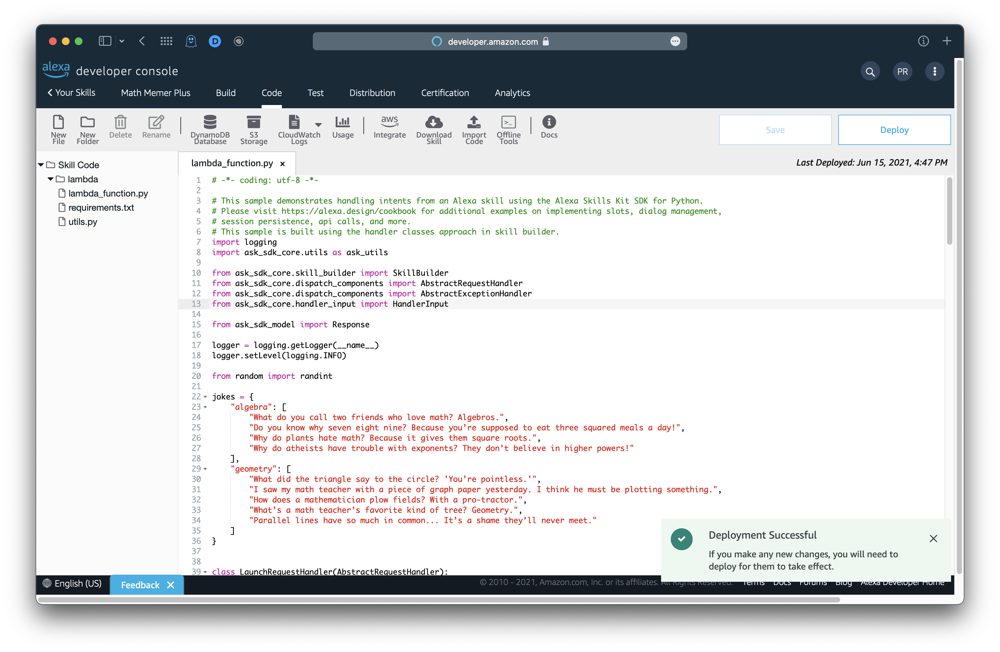
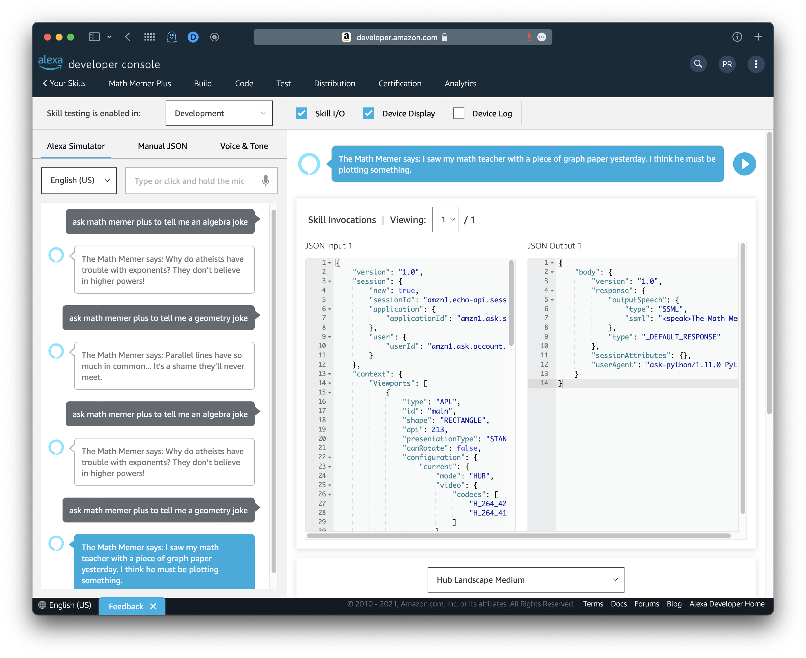

# Math Memer Plus - Intent Example

*Pranav Ramesh*

## Introduction

We will design **Math Memer Plus**, a skill similar to *Math Memer* where Alexa will produce a math meme from a topic of the user's choosing. To begin, create a new skill, "Math Memer Plus".

- Use a **custom** model.
- Make sure to select **Alexa-hosted (Python)** as your hosting method.
- Choose the **Start from Scratch** template.

## Set the invocation name

Once you are on the landing page for your skill, select **Invocation** in the sidebar. Under **Skill Invocation Name**, change the invocation to "math memer plus". Then, click **Save Model** and **Build Model**.



## Create an intent

We will now create a few intents to cover each different topic of math we want to have Alexa ask a joke on. There are two ways to add an intent: through the **Intents** window or the **JSON Editor**. We will explore the usage of both.

>   NOTE: This is better accomplished using a single intent with a slot representing math topic, but for the purposes of this example, we will use multiple intents to each represent a single topic.

### Algebra jokes

We will use the **Intents** window in this first part to add an intent for Alexa to recognize when we want an algebra joke.

In the sidebar, select **Interaction Model**, and click **Intents**. You should see a page with six intents: `HelloWorldIntent`, `AMAZON.CancelIntent`, `AMAZON.HelpIntent`, `AMAZON.StopIntent`, `AMAZON.NavigateHomeIntent`, and `AMAZON.FallbackIntent`.


Click **+ Add Intent**. Under "Create custom intent", enter `AlgebraIntent` as the name. Then, click **Create custom intent**.

You will immediately be greeted with a screen that asks for *sample utterances*, a *dialog delegation strategy*, *intent slots*, and an *intent confirmation*. For now, we will ignore the latter three. Under *sample utterances*, add a few different kinds of way of asking for an algebra joke. Every time you add a new sample utterance, make sure to hit the `+` sign on the right of the cell or hit `ENTER`; otherwise, your utterance will not be registered.



Now that we have these different utterances that direct Alexa to this intent, we can save and build our model. Click **Save Model** and **Build Model**.

### Geometry jokes

We will use the **JSON Editor** in this next part to add an intent for Alexa to recognize when we want an algebra joke.

In the sidebar, click **JSON Editor**. You will be greeted with a small editor containing many properties.

```json
{
    "interactionModel": {
        "languageModel": {
            "invocationName": "math memer plus",
            "intents": [
				# ...
                # ...
                {
                    "name": "AMAZON.FallbackIntent",
                    "samples": []
                },
                {
                    "name": "AlgebraIntent",
                    "slots": [],
                    "samples": [
                        "I want a joke about algebra",
                        "give me a joke about algebra",
                        "tell me an algebra joke",
                        "tell me a joke about algebra",
                        "I want an algebra joke",
                        "give me an algebra joke"
                    ]
                }
				# Start here
            ],
            "types": []
        }
    }
}
```

Notice that one of these **objects**, as we might call them, refers to the `AlgebraIntent` intent that we created in the previous part. Its `"name"` is associated with `"AlgebraIntent"`, there is an empty list `"slots"`, and there is a key, `"samples"`, which is associated with a list of the different utterances for calling this intent.

Under this object, where there is a comment marked `# Start here`, create a new object using `{}`. Make sure that, since you are adding a new object under the `AlgebraIntent` one, you put a comma after the previous `}`. Assign the `"name"` key of the new object to `GeometryIntent`, and assign the `"samples"` key to an empty list. You do not need to add the key-value pair for `"slots"` because we aren't using any.

```json
#...
{
    "name": "AlgebraIntent",
    "slots": [],
    "samples": [
        "I want a joke about algebra",
        "give me a joke about algebra",
        "tell me an algebra joke",
        "tell me a joke about algebra",
        "I want an algebra joke",
        "give me an algebra joke"
    ]
}, # <== Don't forget this comma here!
{
    "name": "GeometryIntent",
    "samples": []
}
#...
```

Copy the contents of the list that you used for the `"samples"` list in `AlgebraIntent` into the `"samples"` list in `GeometryIntent`, but change all occurrences of `algebra` to `geometry`.

```json
#...
{
    "name": "AlgebraIntent",
    "slots": [],
    "samples": [
        "I want a joke about algebra",
        "give me a joke about algebra",
        "tell me an algebra joke",
        "tell me a joke about algebra",
        "I want an algebra joke",
        "give me an algebra joke"
    ]
}, # <== Don't forget this comma here!
{
    "name": "GeometryIntent",
    "samples": [
        "I want a joke about geometry",
        "give me a joke about geometry",
        "tell me an geometry joke",
        "tell me a joke about geometry",
        "I want an geometry joke",
        "give me an geometry joke"
    ]
}
#...
```

Finally, on the top of the page, click **Save Model** and **Build Model**.



### Calculus jokes

As an exercise to you, you may add another intent for Calculus jokes; if you choose to do so, then you may use either the Intents window or the JSON editor.

## Add code

Now that we have our intents, we need to add handlers for them in the code so that Alexa can recognize how to react to an intent call.

Before we proceed to the code, make sure to remember the following intent names that we used:

-   `AlgebraIntent`
-   `GeometryIntent`
-   The intent name(s) of any additional math topic intent(s) you added to your list of intents.

Click the **Code** tab on the top of the screen.

We will first create a dictionary of jokes, as well as import `randint` from `random` so we can select random jokes. Above all the classes, import `randint` from `random`. Then, create a dictionary, `jokes`, and assign it to the following:

```python
# ...
from random import randint

jokes = {
    "algebra": [
        "What do you call two friends who love math? Algebros.",
        "Do you know why seven eight nine? Because you’re supposed to eat three squared meals a day!",
        "Why do plants hate math? Because it gives them square roots.",
        "Why do atheists have trouble with exponents? They don’t believe in higher powers!"
    ],
    "geometry": [
        "What did the triangle say to the circle? 'You’re pointless.'",
        "I saw my math teacher with a piece of graph paper yesterday. I think he must be plotting something.",
        "How does a mathematician plow fields? With a pro-tractor.",
        "What’s a math teacher’s favorite kind of tree? Geometry.",
        "Parallel lines have so much in common... It’s a shame they’ll never meet."
    ]
}
# ...
```

Here, we've added four jokes for algebra and five for geometry. If you added additional intents so that you could ask for jokes from different math topics, be sure to include those jokes in the same manner in `jokes`.

Next, for each intent that we added, we need a respective handler class. Under the `HelloWorldIntentHandler` class, add a new class, titled `AlgebraJokeHandler`. You must inherit from `(AbstractRequestHandler)`.

Then, add the `can_handle()` function with the same parameters and code as the `can_handle()` function in `HelloWorldIntentHandler`, replacing ``"HelloWorldIntent"` with `"AlgebraIntent"` as the argument for the `is_intent_name()` method.

```python
class AlgebraJokeHandler(AbstractRequestHandler):
    """Handler for Algebra Intent"""
    def can_handle(self, handler_input):
        # type: (HandlerInput) -> bool
        return ask_utils.is_intent_name("AlgebraIntent")(handler_input)
```

Note that the code in the `can_handle()` function for any intent handler class will generally be the same in most instances.

We will now implement the `handle()` function. Write the method header for `handle()`. You can include the `# type` comment.

```python
class AlgebraJokeHandler(AbstractRequestHandler):
    """Handler for Algebra Intent"""
    def can_handle(self, handler_input):
        # type: (HandlerInput) -> bool
        return ask_utils.is_intent_name("AlgebraIntent")(handler_input)
    
    def handle(self, handler_input):
        # type: (HandlerInput) -> Response
```

Next, in this function, we need to randomly select a joke from the list associated with the `"algebra"` key in `jokes`. We can do this similarly to how we did in the first Math Memer example.

```python
class AlgebraJokeHandler(AbstractRequestHandler):
    """Handler for Algebra Intent"""
    def can_handle(self, handler_input):
        # type: (HandlerInput) -> bool
        return ask_utils.is_intent_name("AlgebraIntent")(handler_input)
    
    def handle(self, handler_input):
        # type: (HandlerInput) -> Response
        algebra_jokes = jokes["algebra"]
        chosen_joke = algebra_jokes[randint(0, len(algebra_jokes)-1)]
```

Finally, we can recite `chosen_joke` to the user.

```python
class AlgebraJokeHandler(AbstractRequestHandler):
    """Handler for Algebra Intent"""
    def can_handle(self, handler_input):
        # type: (HandlerInput) -> bool
        return ask_utils.is_intent_name("AlgebraIntent")(handler_input)
    
    def handle(self, handler_input):
        # type: (HandlerInput) -> Response
        filtered_jokes = jokes["algebra"]
        chosen_joke = filtered_jokes[randint(0, len(filtered_jokes)-1)]
        
        speak_output = f"The Math Memer says: {chosen_joke}"
        return handler_input.response_builder.speak(speak_output).response
```

We can copy this same code for our geometry (and/or other topics) category, replacing geometry with every occurrence of algebra.

```python
class GeometryJokeHandler(AbstractRequestHandler):
    """Handler for Geometry Intent"""
    def can_handle(self, handler_input):
        # type: (HandlerInput) -> bool
        return ask_utils.is_intent_name("GeometryIntent")(handler_input)
    
    def handle(self, handler_input):
        # type: (HandlerInput) -> Response
        filtered_jokes = jokes["geometry"]
        chosen_joke = filtered_jokes[randint(0, len(filtered_jokes)-1)]
        
        speak_output = f"The Math Memer says: {chosen_joke}"
        return handler_input.response_builder.speak(speak_output).response
```

Now that we have both `AlgebraJokeHandler` and `GeometryJokeHandler`, we need to add corresponding objects of these types to the Alexa `SkillBuilder`. Otherwise, our program will not work.

At the bottom of the code, one line above `sb.add_request_handler(IntentReflectorHandler())`, add the following:

```python
sb = SkillBuilder()

sb.add_request_handler(LaunchRequestHandler())
sb.add_request_handler(HelloWorldIntentHandler())
sb.add_request_handler(HelpIntentHandler())
sb.add_request_handler(CancelOrStopIntentHandler())
sb.add_request_handler(FallbackIntentHandler())
sb.add_request_handler(SessionEndedRequestHandler())
# New code
sb.add_request_handler(AlgebraJokeHandler())
sb.add_request_handler(GeometryJokeHandler())
# ---
sb.add_request_handler(IntentReflectorHandler())
```

Our final code should resemble the following:

```python
# ...
# ...
# ...

from random import randint

jokes = {
    "algebra": [
        "What do you call two friends who love math? Algebros.",
        "Do you know why seven eight nine? Because you’re supposed to eat three squared meals a day!",
        "Why do plants hate math? Because it gives them square roots.",
        "Why do atheists have trouble with exponents? They don’t believe in higher powers!"
    ],
    "geometry": [
        "What did the triangle say to the circle? 'You’re pointless.'",
        "I saw my math teacher with a piece of graph paper yesterday. I think he must be plotting something.",
        "How does a mathematician plow fields? With a pro-tractor.",
        "What’s a math teacher’s favorite kind of tree? Geometry.",
        "Parallel lines have so much in common... It’s a shame they’ll never meet."
    ]
}

# ...
# ...
# ...

class AlgebraJokeHandler(AbstractRequestHandler):
    """Handler for Algebra Intent"""
    def can_handle(self, handler_input):
        # type: (HandlerInput) -> bool
        return ask_utils.is_intent_name("AlgebraIntent")(handler_input)
    
    def handle(self, handler_input):
        # type: (HandlerInput) -> Response
        filtered_jokes = jokes["algebra"]
        chosen_joke = filtered_jokes[randint(0, len(filtered_jokes)-1)]
        
        speak_output = f"The Math Memer says: {chosen_joke}"
        return handler_input.response_builder.speak(speak_output).response


class GeometryJokeHandler(AbstractRequestHandler):
    """Handler for Geometry Intent"""
    def can_handle(self, handler_input):
        # type: (HandlerInput) -> bool
        return ask_utils.is_intent_name("GeometryIntent")(handler_input)
    
    def handle(self, handler_input):
        # type: (HandlerInput) -> Response
        filtered_jokes = jokes["geometry"]
        chosen_joke = filtered_jokes[randint(0, len(filtered_jokes)-1)]
        
        speak_output = f"The Math Memer says: {chosen_joke}"
        return handler_input.response_builder.speak(speak_output).response

# ...
# ...
# ...

sb = SkillBuilder()

sb.add_request_handler(LaunchRequestHandler())
sb.add_request_handler(HelloWorldIntentHandler())
sb.add_request_handler(HelpIntentHandler())
sb.add_request_handler(CancelOrStopIntentHandler())
sb.add_request_handler(FallbackIntentHandler())
sb.add_request_handler(SessionEndedRequestHandler())
sb.add_request_handler(AlgebraJokeHandler())
sb.add_request_handler(GeometryJokeHandler())
sb.add_request_handler(IntentReflectorHandler()) # make sure IntentReflectorHandler is last so it doesn't override your custom intent handlers

sb.add_exception_handler(CatchAllExceptionHandler())

lambda_handler = sb.lambda_handler()
```

Click **Save** and **Deploy**.



## Testing the skill

Before we proceed to test our skill, ensure that you have **built** your model and **deployed** your code. After that, click the **Test** tab on the top of the page. In the dropdown next to "Skill testing is enabled in", select **Development**. This will allow us to converse with Alexa.

To ask Alexa to recite jokes on each topic, you can say:

<center><i>Ask math memer plus to {your intent in an utterance}</i></center>

Some examples include the following:

*   "ask math memer plus to tell me an algebra joke"
*   "ask math memer plus to tell me a geometry joke"

Refer to your sample utterances for a more comprehensive list of what you can ask. If Alexa tells you that it had trouble with the request, type/say "quit" and repeat the utterance again.



**Congratulations! You've created a successful skill with multiple intents that produces a topic-specific math joke when invoked!**